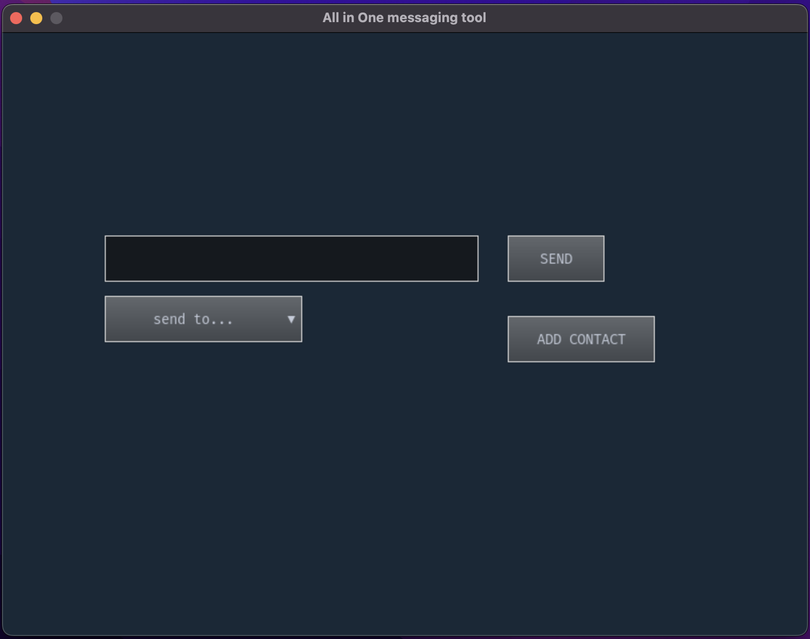
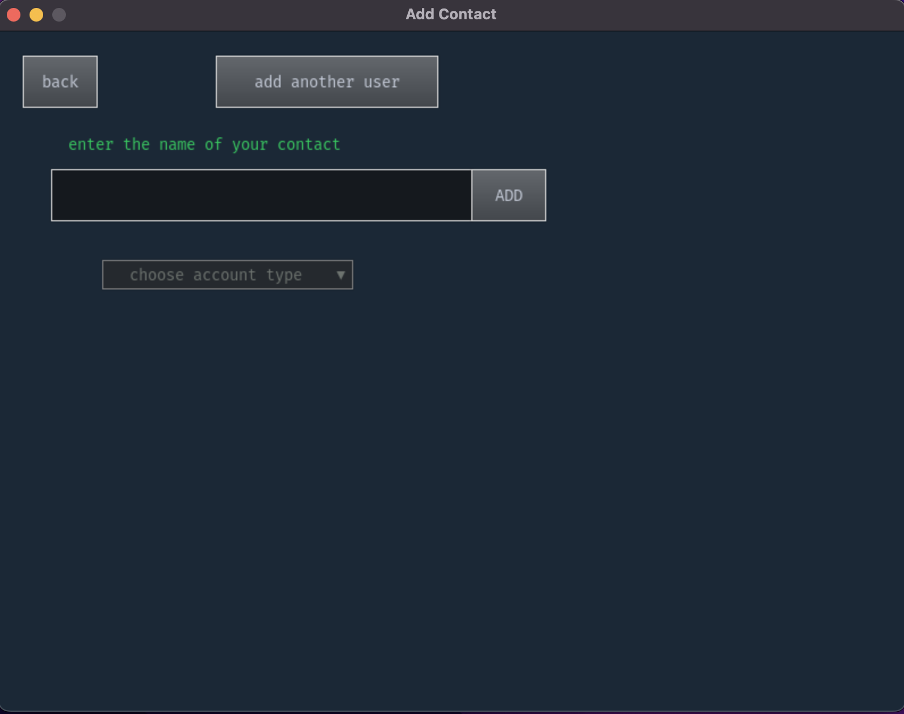

# All-in-one messaging tool
A user friendly program that gives the users the ability to send a message to multiple of their friends accounts.

All-in-one messaging tool currentll supports:
- twitter
- slack
- discord
- email

## Screenshots
 

## Installations
- Clone repository
- `pip install pygame` (windows) `pip3 install pygame` (MacOS)
- `pip install pygame-gui` (windows) `pip3 install pygame-gui` (MacOS)
